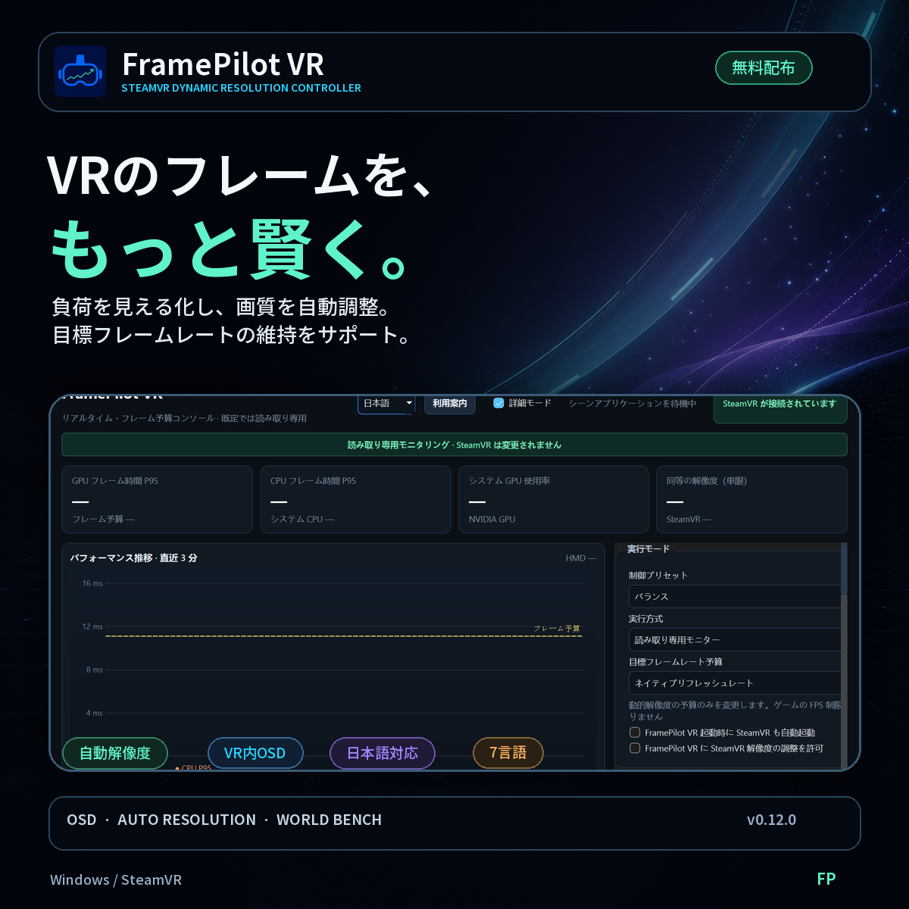

# FramePilot VR

<p align="center">
  <a href="https://passhu.booth.pm/items/8654010">
    
  </a>
</p>

<p align="center">
  <a href="https://passhu.booth.pm/items/8654010"><strong>BOOTH 发布页</strong></a>
  ·
  <a href="https://framepilot-world-bench.passhu.chatgpt.site"><strong>FramePilot World Bench</strong></a>
  ·
  <a href="START_HERE.html"><strong>快速开始</strong></a>
  ·
  <a href="LICENSE"><strong>MIT License</strong></a>
</p>

FramePilot VR 是一个面向 Windows / SteamVR 的开源动态分辨率控制面板。它读取 OpenVR 帧时序、系统 CPU 与 NVIDIA GPU 占用率，按当前头显刷新率计算帧预算，并为当前场景建议或调整 `resolutionScale`。桌面面板与 CLI 工具共用 `steamvr_core.py`，控制逻辑和写入保护一致。

FramePilot VR is an open-source dynamic-resolution controller for Windows and SteamVR. It monitors OpenVR frame timing and system load, then recommends or applies per-application SteamVR resolution changes while keeping write access explicit and recoverable.

VRChat 地图负载观测榜：[FramePilot World Bench](https://framepilot-world-bench.passhu.chatgpt.site)。当前是单设备数据的早期预览，只用于观察方向。

## 获取与安装

- 普通用户：从 [BOOTH 发布页](https://passhu.booth.pm/items/8654010) 获取完整 Windows ZIP。
- 下载后完整解压 ZIP，先阅读 `START_HERE.html`，再运行 `start_panel.bat` 或 `FramePilotVR.exe`。
- 开发者可克隆仓库并使用 Python 3.11+ 运行源码：

```powershell
python -m venv .venv
.\.venv\Scripts\Activate.ps1
python -m pip install -e .
python steamvr_adaptive_gui.py
```

> 发给其他人时请发送完整 ZIP，并让收件人先打开 `START_HERE.html`。必须完整解压，不能只复制 EXE，也不要直接在压缩包内运行。
>
> When sharing, send the complete ZIP and ask the recipient to open `START_HERE.html` first. Extract everything before running; do not send only the EXE.

## 快速开始

1. 启动头显串流软件、SteamVR 和 VR 游戏。
2. 双击 `start_panel.bat`。
3. 默认是“平衡 + 只读监控”，不会修改 SteamVR。
4. 先观察 GPU P95 与帧预算，再运行“只读校准”。
5. 需要验证热更新时，手动勾选“允许 FramePilot VR 调控 SteamVR 分辨率”；“单步自动调整”和“精确阶梯校准”位于高级模式。该选择会保存在本机，直到主动取消。

面板提供：

- 当前游戏、GPU/CPU P95 帧时间、系统 CPU/GPU 占用率和趋势图。
- 支持简体中文、English、日本語、한국어、Français、Deutsch、Español 七种界面语言；选择会保存，下次启动自动沿用。
- Guide 最后一步提供 SteamVR 分辨率控制授权，默认不勾选；用户手动勾选后会缓存该选择。
- 可保存的 SteamVR 自启选项；启用后，FramePilot VR 下次启动时会通过 Steam 请求启动 SteamVR。
- 可选择原生刷新率或刷新率的 1/2、1/3、1/4 作为动态分辨率帧预算目标。
- 保守、平衡、激进三套控制预设。
- 普通模式提供只读和连续自适应；高级模式额外提供单步调整。
- 便携策略 JSON 导入/导出，以及机器本地校准数据库。
- 只读估算校准和需要明确解锁的三阶段精确校准。
- 高级模式提供手动设置与恢复启动值；退出时始终恢复，另有 CSV 日志和托盘入口。

## 界面参数分层

**普通用户直接可见：**控制预设、只读/连续模式、原生或 1/2–1/4 分频、可保存的写入许可、只读校准。这些足以完成日常选择和安全启停。

**高级模式：**“分辨率调节范围与规则”、稳定窗口、冷却时间、单步调整、精确阶梯校准、便携策略导入/导出和手动分辨率。这些规则不会被程序自行修改；自动变化的只有 SteamVR 分辨率。

**从前端软删除：**固定 90/72/60/45/30 FPS、单独的“应用控制参数”按钮、可关闭的“退出时恢复”选项。绝对 FPS 仍可由旧策略或 CLI `--target-fps` 使用；退出恢复在 GUI 中强制启用。

## 跨机器迁移与配置差异

v0.3 将配置分成两层：

1. **便携策略**：可导出的阈值、步长、时间窗口和上下限。导入时强制切回只读，不继承写入权限。
2. **本机校准**：按电脑名、GPU、头显型号、刷新率、SteamVR 推荐渲染尺寸和游戏应用键生成硬件指纹，保存建议分辨率范围。

因此另一台机器可以迁移控制策略，但不会直接套用原机器的最终分辨率。GPU、头显、刷新率或 SteamVR 渲染尺寸变化时会形成新的硬件 ID；旧校准不会自动命中，需要在新配置上重新校准。

本机校准数据库位于：

```text
%LOCALAPPDATA%\SteamVRAdaptiveResolution\strategy-store.json
```

这个文件不会被“导出策略”带走。

## 两种校准

- **只读校准**：保持当前分辨率采样，按 GPU 帧预算做比例估算；不需要解锁，不写 SteamVR。
- **精确阶梯校准**：依次采样当前值、-10% 和 +10%，拟合 GPU 帧时间与分辨率负载的关系；需要先解锁，结束或取消时恢复原值。

校准应在同一个有代表性的游戏场景中进行，尽量保持视角和负载稳定。检测为 CPU 受限时不会用降低分辨率作为主要建议。

## 刷新率分频预算

面板读取当前头显刷新率，再选择原生、1/2、1/3 或 1/4 档位。例如 72 Hz 对应 72、36、24、18 FPS 的预算，帧时间分别约为 13.89、27.78、41.67、55.56 ms；90 Hz 则自动对应 90、45、30、22.5 FPS。分频选择会随便携策略导入/导出，换头显或切换刷新率时无需重填固定数字。

这不是游戏限帧器，也不会修改 SteamVR 头显刷新率。它只改变动态分辨率控制器允许的 GPU 帧时间；实际呈现帧率仍由游戏、SteamVR 调度和重投影决定。低分频会增加运动延迟和伪影风险，应结合舒适度、重投影和实际交付帧率判断。

## 七语言切换

在面板顶部语言下拉框选择简体中文、English、日本語、한국어、Français、Deutsch 或 Español 即可立即切换，不需要重启。控件、状态、提示框、性能建议、校准状态和切换后新产生的事件日志都会使用所选语言。已有日志记录保持生成时的语言，便于保留原始上下文。

## 安全设计

- 默认只读；导入策略后也强制只读。
- CLI `--apply` 每次运行最多自动写入一次；只有同时指定 `--continuous-apply` 才连续调整。
- GUI 的手动、单步、连续和精确校准都要求先确认解锁。
- 只修改当前场景应用节下的 `resolutionScale`，不修改头显串流编码分辨率或码率。
- 精确校准会记录原值，并在结束或面板退出时恢复。

## 正常游玩被动数据采集

面板默认在本机启用匿名负载采集，不控制 VRChat。首次使用 Guide 的最后一步提供“自动上传匿名采集数据”选项，默认勾选并可在完成前取消；主面板也可随时关闭“自动上传新增匿名记录”。进入 VRChat 世界后会自动过滤最初 60 秒加载期；人数稳定时按不重叠的 60 秒窗口汇总负载，人数发生变化时则汇总变化前 20 秒与变化后 30 秒的性能差异。分辨率、刷新率等关键设置发生变化时会自动中断当前窗口，避免把不同条件混为一条记录。

本地共享数据位于：

```text
%LOCALAPPDATA%\SteamVRAdaptiveResolution\shared-telemetry
```

启用自动上传后，面板会在后台增量发送现有及以后尚未上传的有效聚合记录；网络失败会保留本地数据，并在后台延迟重试。取消自动上传后，仍可随时暂停采集、点击“导出共享数据”生成 ZIP，或点击“上传共享数据”手动发送；手动上传前会再次显示数据范围并要求确认。上传成功后会在本地保存断点，后续只发送新增记录。

共享数据包含世界 ID、人数、GPU/HMD 型号、GPU 显存容量、CPU 型号与核心/线程数、系统内存容量、渲染设置及聚合性能数据；不包含玩家身份、VRChat 实例 ID、机器名、硬件序列号或原始硬件指纹。上传入口固定为 Cloudflare Worker，客户端不能直接写入 VPS 数据库或对象目录。

## CLI

```text
FramePilotVRCLI.exe --help
FramePilotVRCLI.exe --duration 60
FramePilotVRCLI.exe --apply
FramePilotVRCLI.exe --apply --continuous-apply
FramePilotVRCLI.exe --target-divisor 2 --duration 60
FramePilotVRCLI.exe --target-divisor 3 --duration 60
FramePilotVRCLI.exe --target-fps 30 --duration 60
FramePilotVRCLI.exe --export-policy policy.json
FramePilotVRCLI.exe --import-policy policy.json --duration 60
FramePilotVRCLI.exe --self-test
```

导入策略在 CLI 中同样强制只读。日志保存在程序旁边的 `logs` 目录。

## 控制逻辑

- 默认使用头显原生刷新率预算，也可选择 1/2、1/3 或 1/4 分频；CLI 仍保留绝对 FPS 兼容入口。
- GPU P95 超过安全阈值，或 GPU 压力较高且出现丢帧/重投影时降档。
- NVIDIA 系统 GPU 占用率达到 97% 时禁止升分辨率，避免在已满载状态下继续撞 GPU 瓶颈。
- CPU P95 超预算而 GPU 明显空闲时判断为 CPU 受限并保持分辨率。
- GPU 与 CPU 持续有余量且交付稳定时逐步升档。
- 使用时间窗口、滞回与冷却避免频繁抖动。

## 重要限制

SteamVR 接受 `resolutionScale` 写入，不代表每款游戏都一定会立即重建渲染纹理；部分游戏可能只在重启时读取设置。启用连续写入前，仍建议在固定代表性场景中进行长时间稳定性验证。

## 源码依赖

- Python 3.11+
- `openvr`
- `psutil`
- `PySide6`

打包版本已包含运行依赖。系统 GPU 百分比通过 NVIDIA `nvidia-smi` 读取；不可用时显示 `n/a`，SteamVR GPU 帧时间仍可正常工作。

## 已完成的本机验证

已在 SteamVR、PICO 4S、90 Hz 和 VRChat `steam.app.438100` 上验证 OpenVR 连接、帧时序读取、按应用设置读取与可恢复写入，并完成连续三天实际使用验证。VRChat 当前测试基线为 40%；构建与面板截图测试保持只读，不改变该值。

## License

FramePilot VR is released under the [MIT License](LICENSE).
